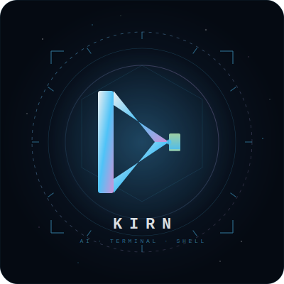

<p align="center">
  
</p>

<h1 align="center">⚡ Kirn</h1>

<p align="center">
  <strong>AI-Integrated Terminal</strong> — A real shell with a local AI assistant built in.<br>
  Offline · On-device · Open source
</p>

<p align="center">
  
  
  
  
  
</p>

---

## What is Kirn?

Kirn is a terminal that understands you. Type shell commands normally — but when you need help, just ask. No APIs, no cloud, no subscriptions. Everything runs locally on your device.

```
rahuldeepak@kirn ~/projects  main ✓ ❯ ls -la            ← real shell command
rahuldeepak@kirn ~/projects  main ✓ ❯ ? what does chmod 777 do  ← ask AI inline
rahuldeepak@kirn ~/projects  main ✓ ❯ @kirn deploy this app     ← autonomous AI
rahuldeepak@kirn ~/projects  main ✓ ❯ command list docker containers  ← generate command
rahuldeepak@kirn ~/projects  main ✓ ❯ git rebase --bad-flag     ← fails → Kirn auto-explains
```

## ✨ Features

### Core
- **Real Shell** — Not a chatbot. A full terminal with bash underneath
- **AI Inline** — Prefix `?` to ask anything, get instant answers
- **Interactive Apps** — Full PTY support. `vim`, `htop`, and `ssh` work perfectly inside Kirn
- **Smart Routing** — Auto-detects if input is a command, question, or action
- **Offline** — Runs 100% locally via [Ollama](https://ollama.ai)
- **Cross-Platform** — Linux desktop + Android via Termux

### AI-Powered
- **Auto Error Explain** — When a command fails, AI explains why with structured `Summary` + `Try these commands`
- **Autonomous Execution** — `@kirn` prefix lets AI chain commands, read output, and self-correct
- **Command Generation** — `command` prefix generates the right shell command without executing it
- **Tool Calling** — `open <app>`, `call <number>`, run commands through AI

### UI/UX
- **ASCII Art Banner** — Custom block-letter KIRN logo with version and help table
- **Rich Prompt** — `user@kirn path  branch* ✓ ❯` with git dirty state and exit code
- **Contextual Spinners** — 4 themed loading animations for different AI actions
- **Session Stats** — On exit, see duration, commands run, AI queries, errors caught
- **Built-in `history`** — View last 25 commands, numbered
- **Built-in `clear`** — Clear the terminal natively
- **Swappable Themes** — Custom color themes in `kirn/themes/`. Terminal background changes to match!

## 🚀 Quick Start

```bash
# 1. Install Ollama (https://ollama.ai)
curl -fsSL https://ollama.ai/install.sh | sh

# 2. Pull the recommended model
ollama pull qwen2.5-coder:7b

# 3. Install pipx (if you don't have it)
sudo apt install pipx    # Debian/Ubuntu
# brew install pipx      # macOS

# 4. Clone & install
git clone https://github.com/rahuldeepak-the-one/kirn.git
cd kirn
pipx install .   # installs 'kirn' globally in an isolated environment

# 5. Run it!
kirn
```

### With uv (recommended for development)
```bash
git clone https://github.com/rahuldeepak-the-one/kirn.git
cd kirn
uv run -m kirn
```

## 📁 Project Structure

```
kirn/
├── main.py                  ← entry point
├── CHANGELOG.md             ← version history
├── requirements.txt
├── assets/
│   └── kirn-logo.svg
└── kirn/
    ├── config.py            ← model, theme, system prompt
    ├── platform.py          ← OS detection (Linux / Android)
    ├── themes/
    │   ├── base.py          ← Theme base class + ASCII banner
    │   └── interstellar.py  ← default theme 🌌
    ├── tui/
    │   ├── prompt.py        ← main terminal loop + spinner + stats
    │   ├── mode.py          ← smart input routing
    │   └── shell.py         ← shell command runner
    └── tools/
        ├── __init__.py      ← tool registry
        ├── app.py           ← open any app
        ├── phone.py         ← make calls (Android)
        └── terminal.py      ← run shell commands via AI
```

## 🎨 Themes

Kirn ships with the **Interstellar** theme — deep-space blues, nebula violet, signal green.

Change themes in `kirn/config.py`:
```python
THEME = "interstellar"
```

Create your own: add a file to `kirn/themes/` with a `COLORS` dict. See `interstellar.py` for reference.

## 🤖 Models

| Model | Size | Best for |
|-------|------|----------|
| `llama3.2:3b` | 2 GB | Default, good for phones |
| `qwen2.5-coder:3b` | 2 GB | Best 3B for terminal |
| `qwen2.5-coder:7b` | 5 GB | Best overall |

Change in `kirn/config.py`:
```python
MODEL = "qwen2.5-coder:7b"
```

## 📱 Android Setup

```bash
# Install Termux from F-Droid (not Play Store)
# Inside Termux:
pkg install python ollama
ollama serve &
ollama pull llama3.2:3b
git clone https://github.com/rahuldeepak-the-one/kirn.git
cd kirn
pip install .
kirn
```

## 🛠️ Adding Tools

1. Create `kirn/tools/your_tool.py` with a `handle_xxx()` function
2. Add the JSON schema + handler in `kirn/tools/__init__.py`
3. Done — Kirn will use it automatically

## 📄 License

MIT

---

<p align="center">
  Built with 🔥 by <a href="https://github.com/rahuldeepak-the-one">rahuldeepak-the-one</a>
</p>